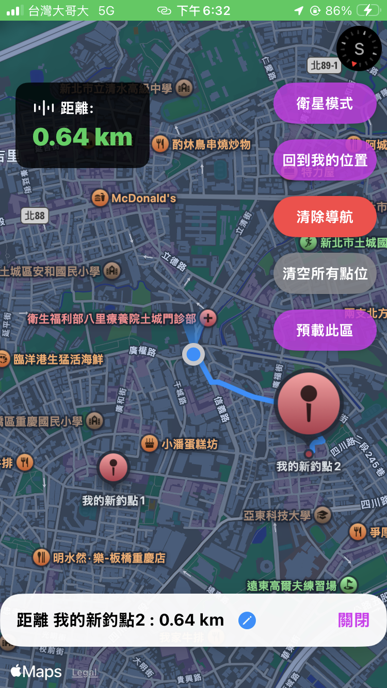
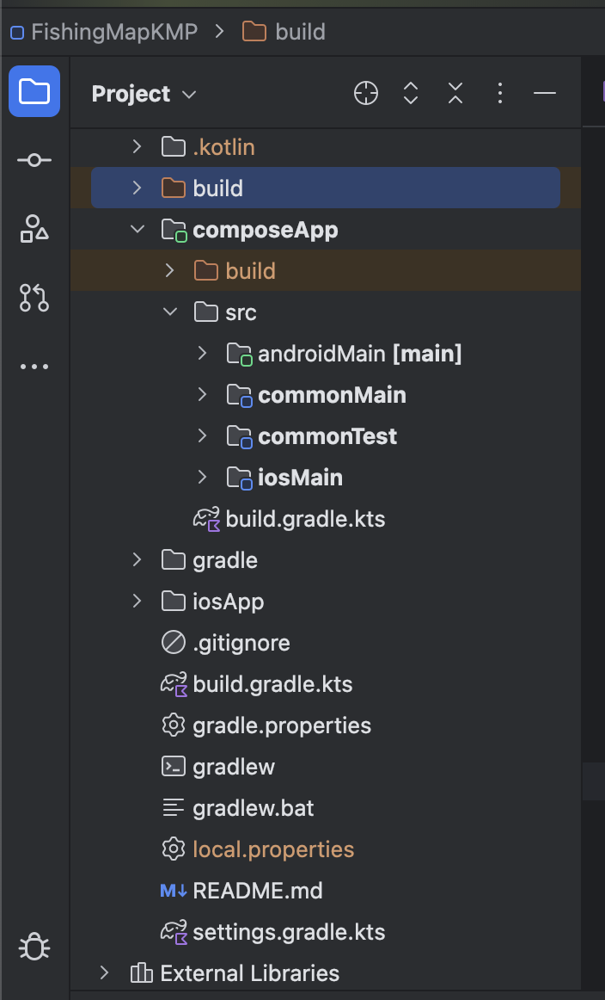

# FishingNav KMP - Offline Marine Navigation System

[繁體中文版 (Traditional Chinese)] (./README.md)

This project is developed using the **Kotlin Multiplatform (KMP)** architecture, specifically designed for fishing vessels to navigate, record fishing markers, and monitor safety in network-blind marine environments.

## 🛠️ Technical Highlights
* **KMP Cross-Platform Architecture**: Achieves shared core logic between Android and iOS, including geographic coordinate calculations and data model management.
* **Responsive State Management (Compose + Flow)**: Utilizes `StateFlow` combined with `collectAsState` to achieve real-time synchronization between cross-platform logic and UI.
* **Cross-Platform Network Layer (Ktor 2.3.12)**: Unifies cross-platform API requests, paired with `kotlinx-serialization` for JSON parsing.
* **Offline Map Engine (OSMDroid)**: Deeply integrates the native OSMDroid framework on Android, supporting local caching and offline satellite tile rendering.
* **Modern UI Implementation**: Fully implemented with Jetpack Compose and SwiftUI, providing a smooth interactive user experience.

## 🛠️ Core Technical Breakthroughs (Android Stability & Cross-Platform Integration)
We successfully resolved critical challenges regarding OSMDroid stability in Compose environments and KMP state synchronization:

* **Single Source of Truth (SSOT)**: To resolve state desynchronization between Android native Views and Compose, the data layer is centralized in the `SharedViewModel`. It forces updates via `StateFlow` to trigger the `AndroidView` update block, achieving "modify once, sync on both platforms."
* **Map Interaction UI Optimization (Custom Marker Interaction)**:
  * Successfully blocked default OSMDroid InfoWindow popups, implementing custom renaming logic using Compose `AlertDialog`.
  * Implemented a "Double-Tap" mechanism: tap to enter navigation mode, double-tap to trigger the renaming window, optimizing the touch experience.
* **Asynchronous UI Conflict Resolution (WindowLeaked)**: Resolved lifecycle crashes during background downloads by implementing a custom `CacheManagerCallback` and `CoroutineScope` for silent download modes.
* **Cross-Platform Tile Preloading Algorithm**: Implemented the Mercator projection formula within `SharedViewModel` to precisely convert coordinate ranges into tile coordinates (X, Y), performing asynchronous multi-threaded downloads via Ktor.
* **iOS Progress Monitoring & Type Interop**:
  * Resolved mismatches between Kotlin `StateFlow` and Swift `AsyncSequence` by encapsulating a `watchProgress` listener in Kotlin to synchronize download progress across platforms.
  * Successfully handled type mapping between `KotlinIntRange` and Swift `ClosedRange`, ensuring the iOS side can accurately trigger download commands.
* **Thread Scheduling Optimization**: Precisely configured switching between `Dispatchers.Main` and `Dispatchers.IO` to ensure download tasks and UI notifications (Toast/Dialog) run on the correct threads.
* **High-Performance Map Rendering**: Optimized the `update` block using `removeAll` logic, preventing marker overlapping and memory leaks caused by excessive Compose recomposition.
* **Smart GPS Route Auto-Detection**:
  * Implemented "instant detection on app launch" and "dynamic trigger on coordinate change."
  * Automatically feeds real-time GPS coordinates into the KMP `SharedViewModel` for computation, eliminating the traditional dependency on manual point-and-click route drawing.
  * Enables seamless dynamic switching between "LAND (Road-based)" and "SEA (Great Circle)" navigation modes via `StateFlow` listening.
* **Smart Geofencing & Collision Avoidance (Geofencing Proximity Alert)**:
  * **Core Logic**: Built upon the `GisGeometryUtils` in the KMP shared layer, implementing a "Future Trajectory Prediction Algorithm."
  * **Mechanism**: Uses `predictFutureLocation` to calculate the vessel's movement vector over the next 3 minutes, performing line-segment intersection detection against offshore wind farm boundaries.
  * **Cross-Platform Synchronization**: Android utilizes `MainActivity`'s `LocationListener` to feed speed and heading data; iOS leverages `CLLocationManager` to sync with the `SharedViewModel`.
  * **Active Alerting**: Automatically triggers real-time UI alerts via `StateFlow` when a collision trajectory is detected, significantly enhancing safety during night or foggy conditions.
* **AI Navigation Anomaly & Collision Detection Mechanism**:
  * **Cross-Platform Unified Dashboard**: Utilizes `SharedViewModel` in the KMP shared layer to maintain a single source of truth for the anomaly status flow (`anomalyStatus`). The state is seamlessly rendered on Android using a Jetpack Compose capsule card atop the right-side button group, and matched symmetrically on iOS via SwiftUI.
  * **Dynamic Visual Feedback**: When the underlying ML model score spikes or triggers an alert (status contains `⚠️`), both platform UIs instantly and dynamically pivot to a semi-transparent red background with bold red typography for real-time, intuitive cognitive alerting.
  * **Bidirectional Simulation & Control**: Implemented `simulateAnomaly` and `resetAnomaly` methods in the KMP `SharedViewModel`. It enables reactive reverse-triggering from native UI layers (Jetpack Compose / SwiftUI buttons), allowing developers or users to simulate extreme current anomalies and clear cache buffers on the fly.

## 📱 Interactive GIS Showcase
* **Dynamic Label Rendering**: Parses government Open Data for wind farm areas (GeoJSON), implementing semi-transparent polygon and label rendering.
* **Real-time Navigation**: Dynamically draws a `Polyline` based on the user's current GPS position and the target marker, calculating sailing distance in real-time.
* **Offline Map Support**: Supports pre-loading satellite imagery for specific regions, ensuring map visual references remain functional in total network-blind environments.

### Project Screenshots
| Android Satellite Navigation | iOS Map Mode |
| :---: | :---: |
|  |  |

### KMP Architecture

## 🏗️ Development Status
- [x] Cross-platform KMP base architecture & Ktor 2.3.12 integration
- [x] SharedViewModel state synchronization logic (StateFlow)
- [x] OSMdroid offline map rendering engine (Android)
- [x] Android-side fishing marker renaming & persistence (MarkerStorage)
- [x] Asynchronous satellite map downloading & caching (Stable)
- [x] Automatic sync with Executive Yuan Open Data Wind Farm info (GeoJSON)
- [x] Real-time bearing calibration & distance calculation (Kotlin Shared Logic)
- [x] iOS Apple Maps integration & real-time location streaming
- [x] iOS offline download UI (ProgressView) & logic binding
- [x] Automatic GPS Smart Route Detection & dynamic mode switching (LAND/SEA)
- [x] AI Navigation Anomaly Detection status flow & real-time Android/iOS dual-platform UI indicator binding
- [x] Bidirectional simulation pipeline for marine anomalies with reactive dual-platform UI state resetting

## 📄 License & Disclaimer
* **Copyright**: © 2026 Ella Liu. All rights reserved.
* **For Interview Exhibition Only**: This project repository and architecture are strictly intended for personal portfolio display and job interview presentations.